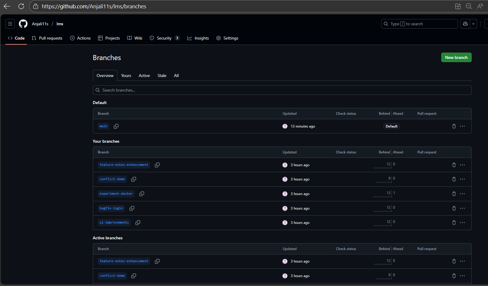
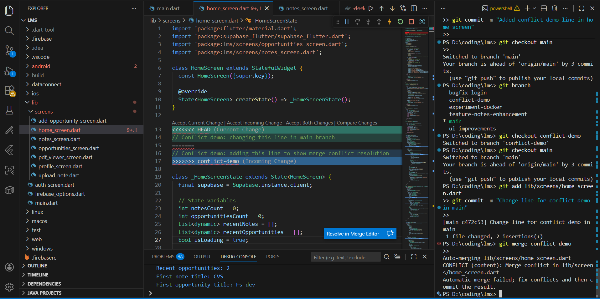
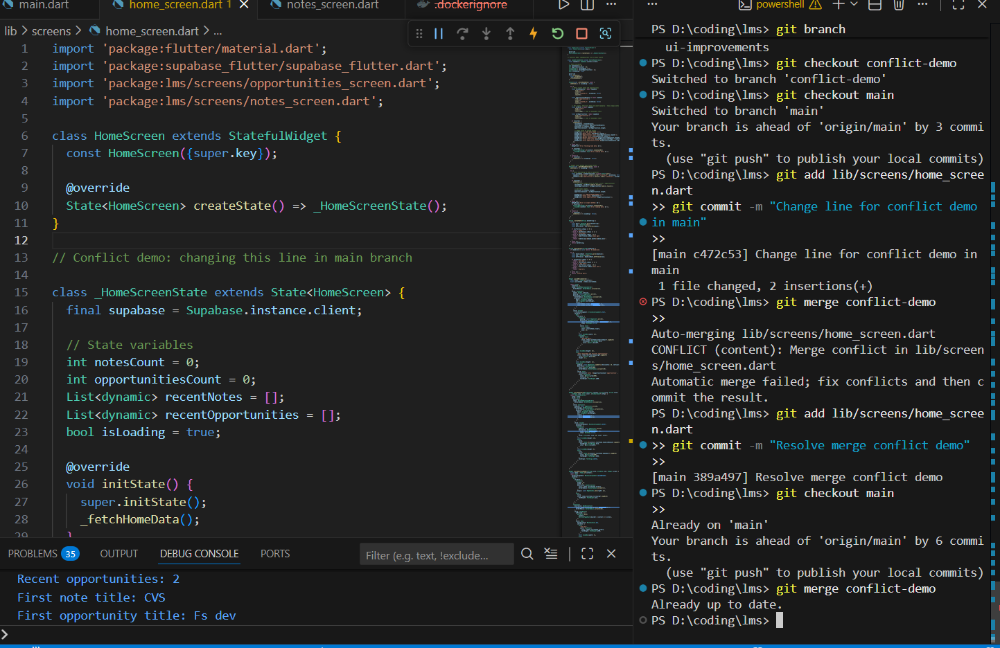
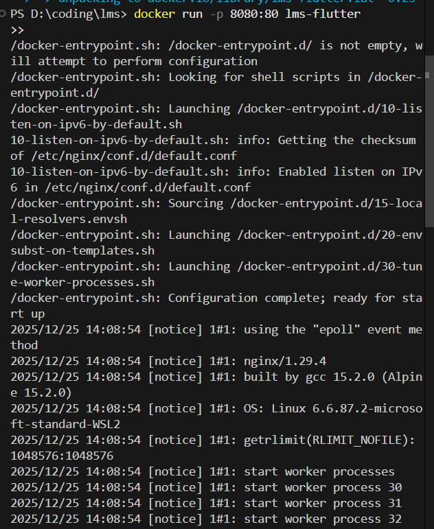
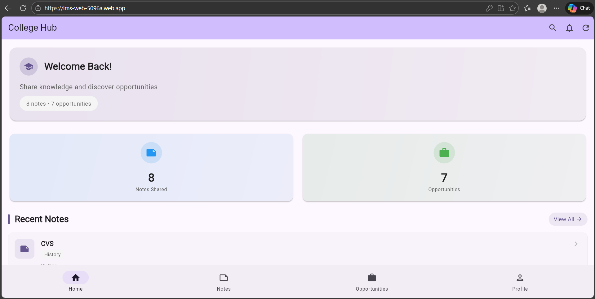
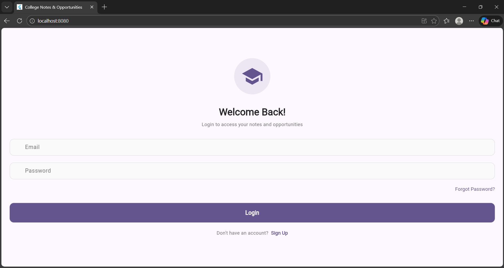

# Friend LMS – Flutter Learning Management System

## 📌 Project Overview
Friend LMS is a cross-platform Learning Management System built using Flutter.
The project allows students to upload notes, explore opportunities, and access academic resources through a clean and responsive UI.

This repository is created to demonstrate:
- Proper Git & GitHub workflow
- Forking, branching, merging, and conflict resolution
- Flutter web development
- Docker usage for Flutter web
- Firebase Hosting deployment

---

## ✨ Key Features
- Firebase Authentication (Login / Signup)
- Notes upload, view, and search
- Opportunities board
- Responsive UI (Web, Android, iOS)
- Dockerized Flutter Web app
- Live deployment using Firebase Hosting

---

## 🏗️ Project Structure
```text
lms/
├── lib/
│   ├── screens/
│   │   ├── home_screen.dart
│   │   ├── notes_screen.dart
│   │   ├── upload_note.dart
│   │   ├── opportunities_screen.dart
│   │   ├── add_opportunity_screen.dart
│   │   ├── profile_screen.dart
│   │   ├── auth_screen.dart
│   │   └── pdf_viewer_screen.dart
│   └── main.dart
├── assets/
├── pubspec.yaml
├── Dockerfile
├── firebase.json
└── README.md
```

## 🚀 Flutter Commands Used
- flutter pub get
- flutter run -d chrome
- flutter build web --release

## 🐳 Docker Commands Used
- docker build -t lms-flutter .
- docker run -d -p 8080:80 lms-flutter
- docker ps
- docker logs <container_id>

## 🔥 Firebase Hosting
- firebase init hosting
- firebase deploy --only hosting


## Live Website:
- https://lms-web-5096a.web.app/

## 🔧 Git & GitHub Workflow
### 1️⃣ Forking the Repository

- Open the original repository on GitHub

- Click Fork

- Creates a copy under your GitHub account

### 2️⃣ Cloning the Forked Repository
- git clone https://github.com/Anjali11s/lms.git
- cd lms

### 3️⃣ Working on Main Branch First

 Initial development was done directly on the main branch.

- git checkout main
- git add .
- git commit -m "Initial LMS setup with screens and Firebase integration"
- git push origin main

### 4️⃣ Creating Feature Branches
- git checkout -b ui-improvements
- git checkout -b bugfix-login
- git checkout -b feature-notes-enhancement
- git checkout -b experiment-docker

### 5️⃣ Working on Branches & Pushing
- git add .
- git commit -m "Meaningful commit message"
- git push origin branch_name


#### Branches used:

- ui-improvements

- bugfix-login

- feature-notes-enhancement

- experiment-docker

### 6️⃣ Merging Branches into Main
- git checkout main
- git merge ui-improvements
- git merge bugfix-login
- git merge feature-notes-enhancement
- git merge experiment-docker
- git push origin main

### 7️⃣ Merge Conflict Demonstration

Intentional conflict created for demo purposes:

- git checkout -b conflict-demo
# Conflicting changes made
- git commit -m "Create intentional conflict"
- git push origin conflict-demo

- git checkout main
#### Different changes made
- git commit -m "Change same file in main"

- git merge conflict-demo


### Conflict resolved manually and committed successfully.

## 📸 Screenshots Included

### 📊 GitHub Branches

Multiple branches showing Git workflow (main, ui-improvements, bugfix-login, feature-notes-enhancement, experiment-docker).

### ⚠ Merge Conflict

Intentional conflict created in `home_screen.dart` to demonstrate merge conflict.

### ✅ Merge Conflict Resolution

Conflict resolved manually and committed successfully.

### 🐳 Docker Build

Built Docker image for Flutter web application using `docker build -t lms-flutter .`.

### 🐳 Docker Run

Running the container locally using `docker run -p 8080:8080 lms-flutter`.

### 🔥 Firebase Hosting (Live Deployment)

Live deployment on Firebase Hosting: [https://lms-web-5096a.web.app/](https://lms-web-5096a.web.app/)

### 🌐 Localhost Preview

Flutter web running locally on Docker at `http://localhost:8080/`.


📚 Learning Outcomes

Forking & cloning repositories

Working with multiple branches

Clean merging strategies

Merge conflict handling

Docker usage with Flutter Web

Firebase Hosting deployment

👩‍💻 Author

Anjali Singh
Department of Computer Science & Engineering

🔗 Project Links

GitHub Repository:
https://github.com/Anjali11s/lms

Live Demo:
https://lms-web-5096a.web.app/

📄 License

Developed for academic and educational purposes.

Last Updated: December 2025
Status: ✅ Completed